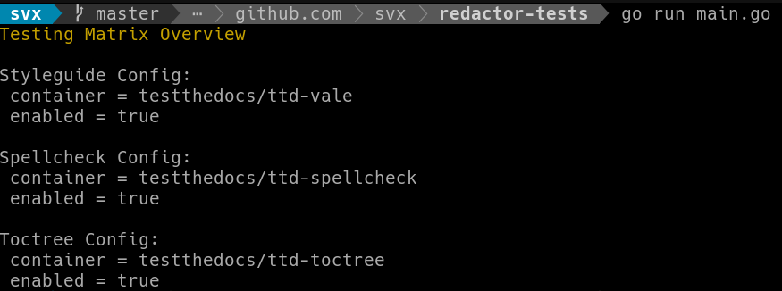

Documentation Quality Assurance Framework aka editor in chief.

A opinionated testing framework for documentation.

## Main Features

* A set of checks to imporve documentation

## Getting Started

### Prerequisites/Requirements

* [Docker](https://docker.com/)

## Documentation

Full documentation for end users can be found in the "docs" folder.

## Contribute

* [Issue Tracker](https://github.com/testthedocs/redactor/issues/)
* [Source Code](https://github.com/testthedocs/redactor/)

## License

The project is licensed under the GPLv2.

Support
=======

If you are having issues, please let us `know <https://github.com/testthedocs/redactor/issues/>`_.
