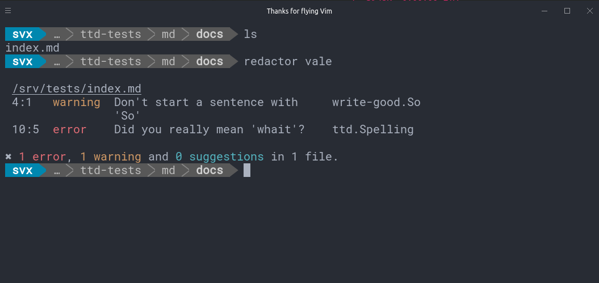
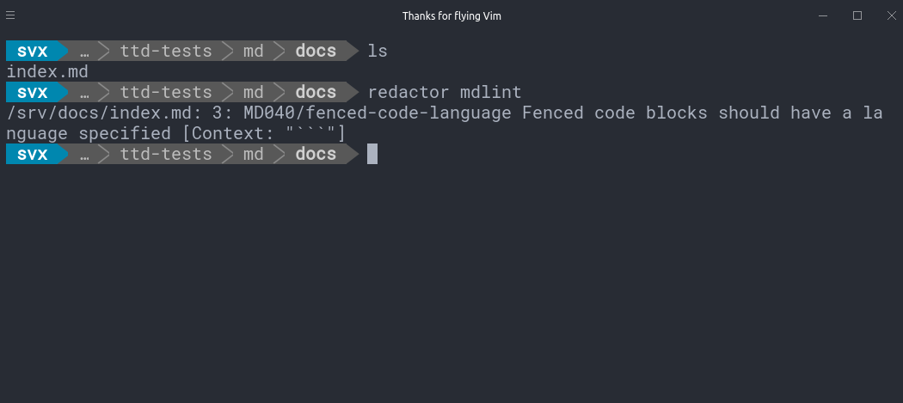

=====
Usage
=====

.. note::

    `redactor` is meant to run from within the directory including your documentation !

    If for example your documentation is located under */docs* you first have to change into this directory.

Example:

.. code-block:: console

    cd docs
    redactor mdlint

Help
====

.. code-block:: console

    redactor help

Vale
====

.. code-block:: console

    redactor vale

Markdown Lint
=============

.. code-block:: console

    redactor mdlint

